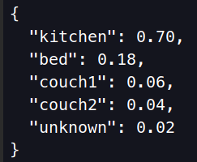

You can see part of my portfolio below. Visit [my GitHub](https://github.com/kootenpv/) for more source code.

<table id="repo-table">
<tbody>
<tr>
    <td id="whereami">

      
      
<i class="fa fa-star"></i>whereami

      
    
</td>
    <td id="shrynk">

      
      
<i class="fa fa-star"></i>shrynk

      
    
</td>
</tr>
<tr>
    <td id="yagmail">

      
      
<i class="fa fa-star"></i>yagmail

      
    
</td>
    <td id="neural_complete">

      
      
<i class="fa fa-star"></i>neural_complete

      
    
</td>
</tr>
<tr>
    <td id="sky">

      
      
<i class="fa fa-star"></i>sky

      
    
</td>
    <td id="sysdm">

      
      
<i class="fa fa-star"></i>sysdm

      
    
</td>
</tr>
<tr>
    <td id="gittyleaks">

      
      
<i class="fa fa-star"></i>gittyleaks

      
    
</td>
    <td id="brightml">

      
      
<i class="fa fa-star"></i>brightml

      
    
</td>
</tr>
</tbody>
</table>

Presentations:

- [SQL Injection](/injectable_presentation/) processed 1.8 billion links searched for vulnerability
